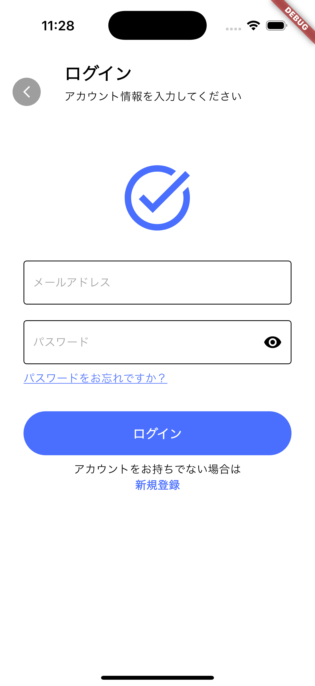

# task_flow

## 目的

- DDDの知識定着
- 自分なりのアーキテクチャを考える
- Firebase（Cloud Firestore、Authentication）を使用してデータベース連携を経験

## アプリ概要

- task_flowはTodo機能を実装した単純なタスク管理アプリです
- メールアドレスとパスワードでアカウント作成、ログインをします
- TodoにはCRUD操作を付与しており、未完了と完了Todoを画面で分けています

## スクリーンショット

### Authentication関連

| 初期画面 | 新規登録 | ログイン画面 |
|:---:|:---:|:---:|
|  |  |  |

### Todo関連

| Todoリスト | 完了 | Todo追加 |
|:---:|:---:|:---:|
|  |  |  |

### プロフィール

| プロフィール | ログアウト |
|:---:|:---:|
|  |  |

## 環境構築
### リポジトリをクローン
```bash
git clone https://github.com/yukimiyake0607/task_flow.git
```
### ディレクトリを移動
```bash
cd task_flow
```
### fvmをインストール
```bash
brew tap leoafarias/fvm
brew install fvm
```
### プロジェクトで指定されたバージョンのFlutterをインストール
```bash
fvm use
```
### パッケージをインストール
```bash
fvm flutter pub get
```

## フォルダ階層

<pre>
lib
├── firebase_options.dart
├── main.dart
└── src
    ├── app.dart
    ├── common_widgets
    │   ├── appbar
    │   │   └── custom_appbar.dart
    │   ├── bottom_navigation
    │   │   ├── bottom_navigation_provider.dart
    │   │   └── bottom_navigation.dart
    │   ├── empty_placeholder_widget.dart
    │   ├── error_page.dart
    │   └── loading_page.dart
    ├── constants
    │   ├── setting_theme.dart
    │   ├── textstyles.dart
    │   └── todo_theme.dart
    ├── extensions
    │   ├── messages
    │   │   └── auth_error_message.dart
    │   └── snack_bar.dart
    ├── features
    │   ├── authentication
    │   │   ├── data
    │   │   │   ├── auth_repository_interface.dart
    │   │   │   └── auth_repository.dart
    │   │   └── presentation
    │   │       ├── auth_controller.dart
    │   │       ├── auth_controller.g.dart
    │   │       ├── auth_page.dart
    │   │       ├── login
    │   │       │   ├── forgot_password_page.dart
    │   │       │   └── login_page.dart
    │   │       ├── register
    │   │       │   └── register_page.dart
    │   │       └── widgets
    │   │           ├── auth_button.dart
    │   │           └── auth_white_button.dart
    │   ├── home
    │   │   └── home_page.dart
    │   ├── profile
    │   │   └── presentation
    │   │       ├── profile_page.dart
    │   │       ├── section_pages
    │   │       │   ├── email_setting_page.dart
    │   │       │   ├── help_and_support_page.dart
    │   │       │   ├── password_setting_page.dart
    │   │       │   └── terms_and_policies_page.dart
    │   │       └── widgets
    │   │           ├── logout_dialog.dart
    │   │           ├── setting_item.dart
    │   │           └── show_logout_dialog_button.dart
    │   └── todo
    │       ├── data
    │       │   ├── empty_todo_repository_impl.dart
    │       │   ├── interface
    │       │   │   └── todo_repository_interface.dart
    │       │   ├── todo_provider.dart
    │       │   └── todo_repository_impl.dart
    │       ├── domain
    │       │   ├── todo_model.dart
    │       │   ├── todo_model.freezed.dart
    │       │   └── todo_model.g.dart
    │       └── presentation
    │           ├── completed
    │           │   └── completed_page.dart
    │           ├── incompleted
    │           │   ├── todo_list_widget.dart
    │           │   ├── todo_page.dart
    │           │   └── todo_section.dart
    │           ├── todo_card.dart
    │           ├── todo_controller.dart
    │           ├── todo_controller.g.dart
    │           └── todo_dialog.dart
    └── routing
        ├── not_found_page.dart
        ├── router.dart
        └── router.g.dart
</pre>

### ファイル分割の方針
基本的に関心事ごとにファイルを分割しています。例えば、実際に目に触れるものはすべてUIフォルダに保管しています。ファイル名は関心事.dartとします。

## 環境
|  | バージョン |
|:---:|:---:|
| Dart | 3.7.2 |
| Flutter | 3.29.2 |

## CI
[GitHub Actions](https://github.co.jp/features/actions)を利用してCIを構築しています。
プルリクエストが作成や更新されたときにCIが発火します。